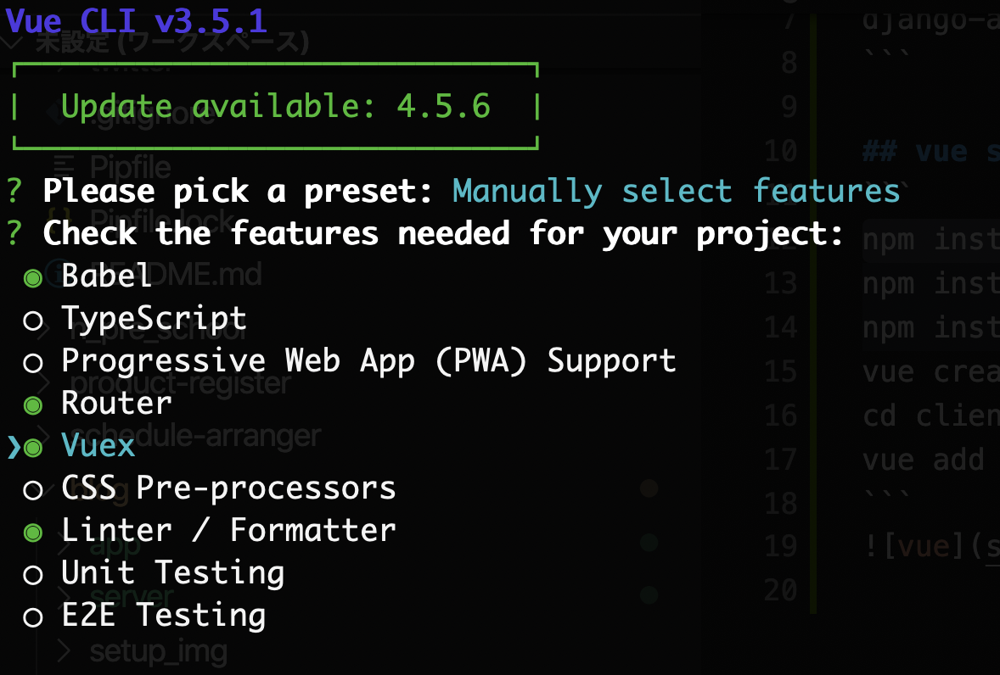
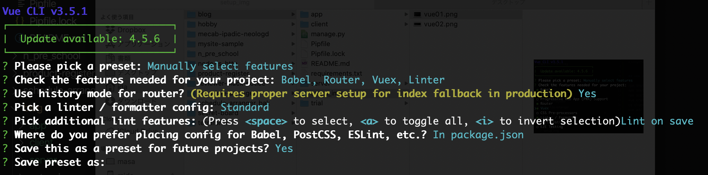

# blog
```
cf. https://nmomos.com/tips/2019/07/17/django-vuejs-1/
```

## django setup
```
pipenv shell
django-admin startproject server .
pipenv install -r ./requirements.txt
django-admin startapp app
```

## vue setup
```
npm install -g @vue/cli@3.5.1
vue create client
cd client
npm install --save axios
npm run serve
```



## django setup2
```
cd ..
python manage.py runserver
```

## backend implementation
```
python manage.py migrate
python manage.py createsuperuser
```
